### 分代回收策略

#### 年轻代（Yong Generation）

新生代的对象优先级存放在新生代中，存活率很低

新生代中，常规应用进行一次垃圾收集一般可以回收70%~95%的空间，回收效率很高

一般采用的GC回收算法是复制算法

新生代细分为3部分：Eden、Survivor0（简称S0）、Survivor1（简称S1）

这3部分按照8：1：1的比例来划分新生代

---

绝大多数刚刚被创建的对象会存放在 Eden 区。

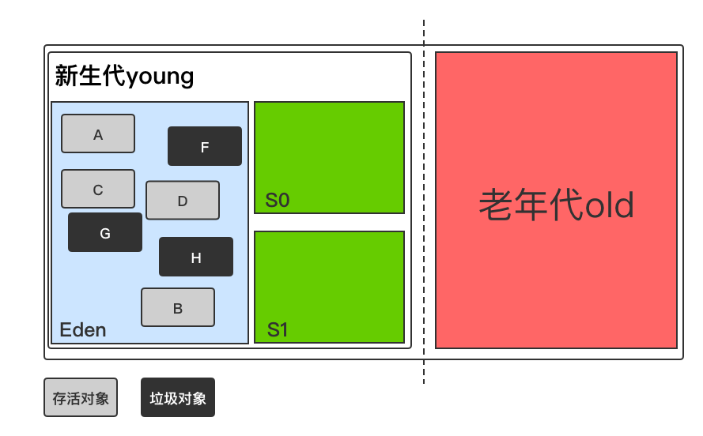

当 Eden 区第一次满的时候，会进行垃圾回收。首先将 Eden区的垃圾对象回收清除，并将存活的对象复制到 S0，此时 S1是空的。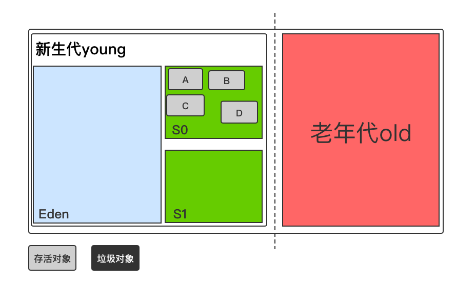下一次 Eden 区满时，再执行一次垃圾回收。此次会将 Eden和 S0区中所有垃圾对象清除，并将存活对象复制到 S1，此时 S0变为空。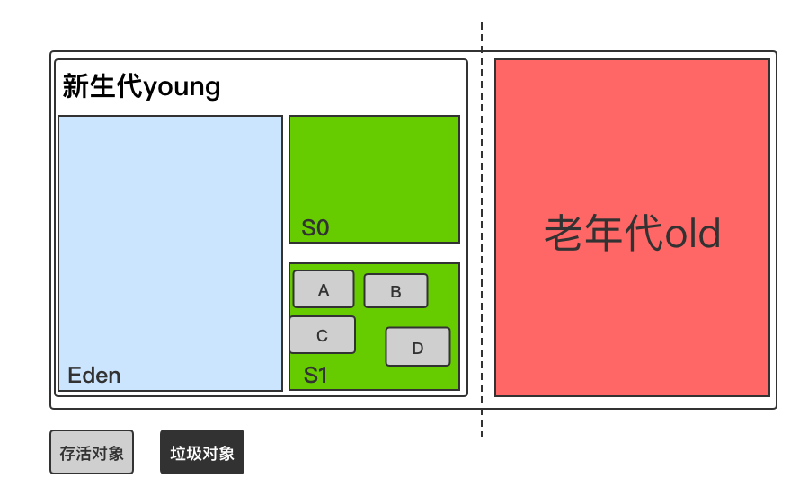

如此反复在 S0 和 S1之间切换几次（默认 15 次）之后，如果还有存活对象。说明这些对象的生命周期较长，则将它们转移到老年代中。

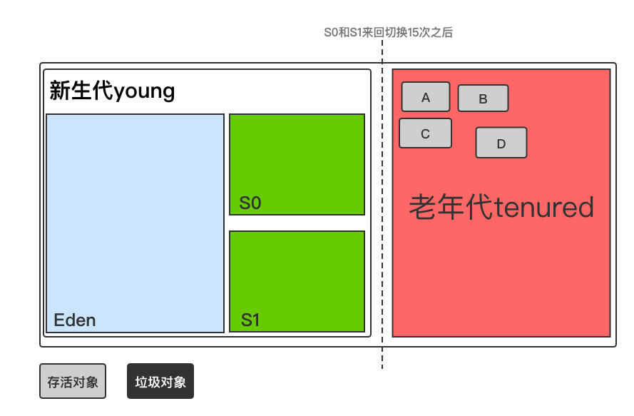

#### 年老代（Old Generation）

一个对象如果在新生代存活了足够长的时间而没有被清理掉，则会被复制到老年代老年代的内存大小一般比新生代大，能存放更多的对象

如果对象比较大（比如长字符串或者大数组），并且新生代的剩余空间不足，则这个大对象会直接被分配到老年代上。

 -XX:PretenureSizeThreshold 来控制直接升入老年代的对象大小，大于这个值的对象会直接分配在老年代上。

老年代因为对象的生命周期较长，不需要过多的复制操作，所以一般采用**标记压缩**的回收算法。

> 对于老年代可能存在这么一种情况，老年代中的对象有时候会引用到新生代对象。这时如果要执行新生代 GC，则可能需要查询整个老年代上可能存在引用新生代的情况，这显然是低效的。所以，老年代中维护了一个 512 byte 的 card table，所有老年代对象引用新生代对象的信息都记录在这里。每当新生代发生 GC 时，只需要检查这个 card table 即可，大大提高了性能。

### GC Log分析

为了让上层应用开发人员更加方便的调试 Java 程序，JVM 提供了相应的 GC 日志

在 GC 执行垃圾回收事件的过程中，会有各种相应的 log 被打印出来

其中新生代和老年代所打印的日志是有区别的

- 新生代GC：

  这一区域的 GC 叫作 Minor GC

  因为 Java 对象大多都具备朝生夕灭的特性，所以 Minor GC 非常频繁，一般回收速度也比较快

- 老年代GC：

  发生在这一区域的 GC 也叫作 Major GC 或者 Full GC

  当出现了 Major GC，经常会伴随至少一次的 Minor GC

### 引用（续）

JVM中的引用关系并不止一种，而是有四种，根据引用强度的由强到弱，他们分别是：强应用（Strong Reference）、软引用（Soft Reference）、弱引用（Weak Reference）、虚引用（Phantom Reference）

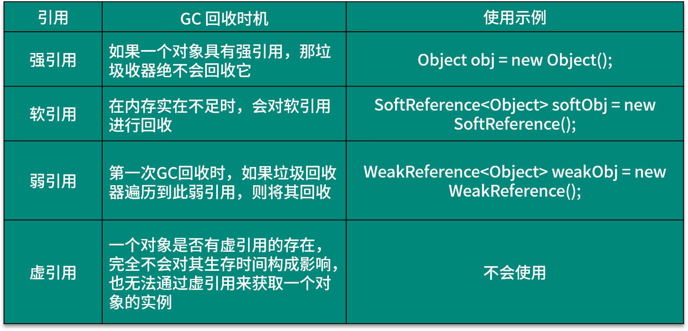

#### 软引用常规使用

>平时项目中，尤其是Android项目，因为有大量的图像(Bitmap)对象，使用软引用的场景较多。所以重点看下软引用SoftReference的使用，不当的使用软引用有时也会导致系统异常。

代码：

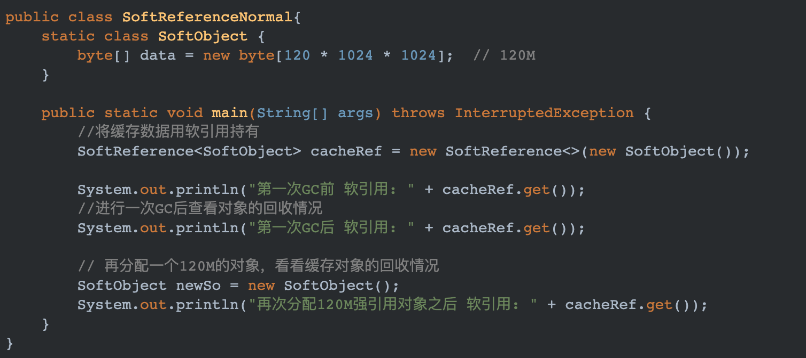

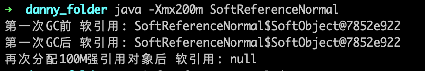

##### 软引用隐藏问题

注意：

被软引用对象关联的对象会自动被垃圾回收器回收

但是软引用对象本身也是一个对象，这些创建的软引用并不会自动被垃圾回收器回收掉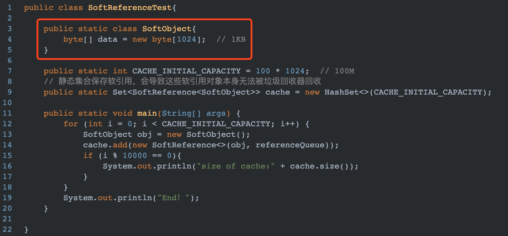

上述代码，虽然每一个SoftObject都被一个软引用所引用，在内存紧张时，GC会将SoftObject所占用的1KB回收。但是每一个SoftReference又都被Set所引用(强引用)。执行上述代码结果如下：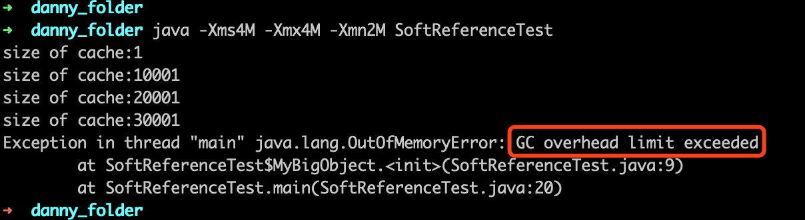

限制堆内存大小为4M，最终程序崩溃，但是异常的原因并不是普通的堆内存溢出，而是"GC overhead"。之所以会抛出这个错误，是由于虚拟机一直在不断回收软引用，回收进行的速度过快，占用的cpu过大(超过98%)，并且每次回收掉的内存过小(小于2%)，导致最终抛出了这个错误。

这里需要做优化，合适的处理方式是注册一个引用队列，每次循环之后将引用队列中出现的软引用对象从cache中移除。如下所示：

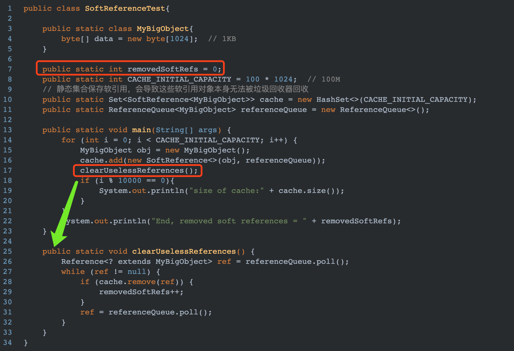

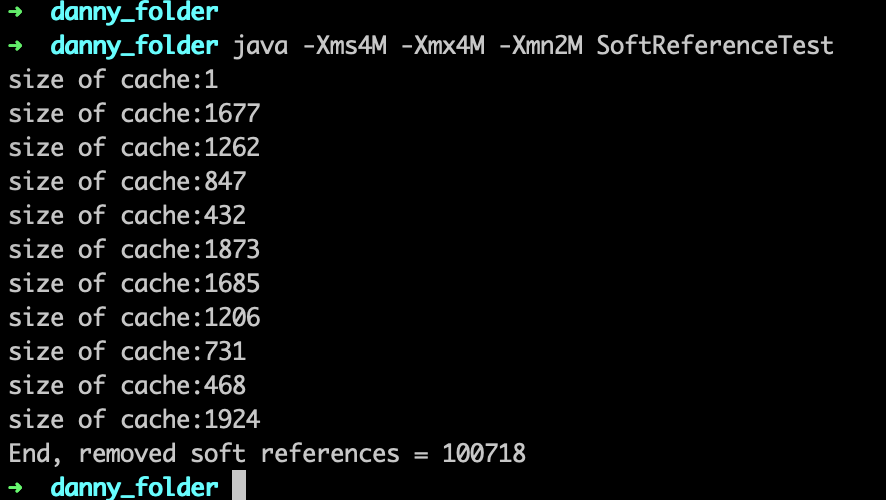