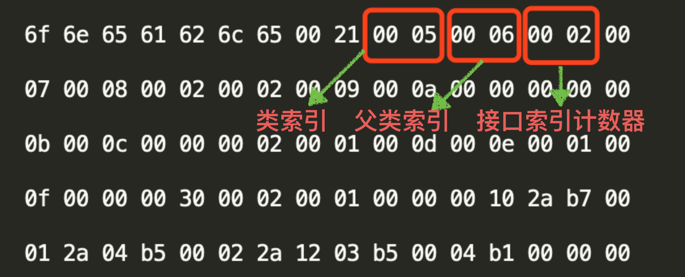

### class的来龙去脉

java提供了一种可以在所有平台上都能使用的一种中间码--字节码类文件（.class文件）

- 有了字节码，无论是在哪种平台只要安装了虚拟机都可以直接运行字节码
- 有了字节码，解除了java虚拟机和java语言之间的耦合


### 上帝视角看class文件

从纵观的角度来看class文件，class文件里只有两种数据结构：无符号数和表

- 无符号数：属于基本的数据类型

  ​					以 u1、u2、u4、u8 来分别代表 1 个字节、2 个字节、4 个字节和 8 					个字节的无符号数，无符号数可以用来描述数字、索引引用、数量值					或者字符串（UTF-8 编码）

- 表：表是由多个无符号数或者其他表作为数据项构成的复合数据类型

  ​		class文件中所有的表都以“_info”结尾

  ​		整个class文件本质上就是一张表

### class文件结构

无符号数和表组成了class中的各个结构

这些结构按照预先规定好的顺序紧密的从前向后排列，相邻的项之间没有任何间隙


#### 案例分析

```java
import java.io.Serializable;

 

public class Test implements Serializable, Cloneable{

      private int num = 1;

 

      public int add(int i) {

          int j = 10;

          num = num + i;

          return num;

     }

}
```

通过 javac 将其编译，生成 Test.class 字节码文件。然后使用 16 进制编辑器打开 class 文件，显示内容如下所示：

上图中都是一些 16 进制数字，每两个字符代表一个字节。乍看一下各个字符之间毫无规律，但是在 JVM 的视角里这些 16 进制字符是按照严格的规律排列的。

##### 魔数 magic number


在class文件开头的四个字节是class文件的魔数，它是一个固定的值--0XCAFEBABE

魔数是class文件的标志，它是判断一个文件是不是class格式文件的标准

##### 版本号


魔数后四个字节代表当前class文件版本号。前两个字节0000代表版本号（minor_version），后两个字节0034是主版本号（major_version），对应十进制为52

当前class文件的主版本号为52，次版本号为0

所以综合版本号是52.0，也就是jdk1.8.0

##### 常量池（重点）

紧跟在版本号之后的是一个叫做常量池的表（cp_info）

在常量池中保存了类的各种相关信息

比如类的名称、父类的名称、类中的方法名、参数名称、参数类型等

**常量池中的每一项都是一个表，其项目类型共有 14 种，如下表所示：**


常量池中的每一项都会有一个 u1 大小的 tag 值。tag 值是表的标识，JVM 解析 class 文件时，通过这个值来判断当前数据结构是哪一种表。以上 14 种表都有自己的结构，这里不再一一介绍，就以 CONSTANT_Class_info 和 CONSTANT_Utf8_info 这两张表举例说明，因为其他表也基本类似。

首先，CONSTANT_Class_info 表具体结构如下所示：

```java
table CONSTANT_Class_info {

    u1  tag = 7;

    u2  name_index;

}
```

tag:

占用一个字节大小

比如值为7，说明是CONSTANT_Class_info类型表

name_index：

是一个索引值，可以将它理解为一个指针

指向常量池中索引为 name_index 的常量表

比如 name_index = 2，则它指向常量池中第 2 个常量

---

接下来再看 CONSTANT_Utf8_info 表具体结构如下：

```java
table CONSTANT_utf8_info {

    u1  tag;

    u2  length;

    u1[] bytes;

}
```

- tag:

值为1，表示是 CONSTANT_Utf8_info 类型表

length：

length 表示 u1[] 的长度，比如 length=5，则表示接下来的数据是 5 个连续的 u1 类型数据。

bytes：u1 类型数组，长度为上面第 2 个参数 length 的值。

---

java代码中声明的String字符串最终在class文件中的存储格式就CONSTANT_utf8_info。因此一个字符串最大长度也就是u2所能代表的最大值65536个，但是需要使用2个字节来保存 null 值，因此一个字符串的最大长度为 65536 - 2 = 65534。参考 [Java String最大长度分析](https://mp.weixin.qq.com/s/I16BlY9cJF-JZZReAjuRqg)。

---


class 文件在常量池的前面使用 2 个字节的容量计数器，用来代表当前类中常量池的大小。


红色框中的 001d 转化为十进制就是 29，也就是说常量计数器的值为 29。其中下标为 0 的常量被 JVM 留作其他特殊用途，因此 Test.class 中实际的常量池大小为这个计数器的值减 1，也就是 28个。

第一个常量，如下所示：


0a 转化为 10 进制后为 10，通过查看常量池 14 种表格图中，可以查到 tag=10 的表类型为 CONSTANT_Methodref_info，因此常量池中的第一个常量类型为方法引用表。其结构如下：

```java
CONSTANT_Methodref_info {

    u1 tag = 10;

    u2 class_index;        指向此方法的所属类

    u2 name_type_index;    指向此方法的名称和类型

}
```

也就是说在“0a”之后的 2 个字节指向这个方法是属于哪个类，紧接的 2 个字节指向这个方法的名称和类型。它们的值分别是：

- 0006：十进制 6，表示指向常量池中的第 6 个常量。
- 0015：十进制 21，表示指向常量池中的第 21 个常量。

至此，第 1 个常量就解读完毕了。紧接着的就是第 2 个常量，如下所示：

tag **09** 表示是字段引用表 CONSTANT_FIeldref_info ，其结构如下：

```
CONSTANT_Fieldref_info{

    u1 tag;

    u2 class_index;        指向此字段的所属类

    u2 name_type_index;    指向此字段的名称和类型

}
```

同样也是 4 个字节，前后都是两个索引。

- 0005：指向常量池中第 5 个常量。
- 0016：指向常量池中第 22 个常量。

到现在为止我们已经解析出了常量池中的两个常量。剩下的 21 个常量的解析过程也大同小异，这里就不一一解析了。实际上我们可以借助 javap 命令来帮助我们查看 class 常量池中的内容：

```
javap -v Test.class
```


正如我们刚才分析的一样，常量池中第一个常量是 Methodref 类型，指向下标 6 和下标 21 的常量。其中下标 21 的常量类型为 NameAndType，它对应的数据结构如下：

```
CONSTANT_NameAndType_info{

    u1 tag;

    u2 name_index;    指向某字段或方法的名称字符串

    u2 type_index;    指向某字段或方法的类型字符串

}
```

而下标在 21 的 NameAndType 的 name_index 和 type_index 分别指向了 13 和 14，也就是“<init>”和“()V”。因此最终解析下来常量池中第 1 个常量的解析过程以及最终值如下图所示：

##### 访问标志（access_flags）

紧跟在常量池之后的常量是访问标志，占用两个字节


访问标志代表类或者接口的访问信息

比如：该 class 文件是类还是接口，是否被定义成 public，是否是 abstract，如果是类，是否被声明成 final 等


我们定义的 Test.java 是一个普通 Java 类，不是接口、枚举或注解。并且被 public 修饰但没有被声明为 final 和 abstract，因此它所对应的 access_flags 为 **0021**（0X0001 和 0X0020 相结合）。

##### 类索引、父索引与接口索引计数器

表之后的2个字节就是**类索引**

类索引后的 2 个字节就是**父类索引**

父类索引后的 2 个字节则是**接口索引计数器**



可以看出类索引指向常量池中的第 5 个常量，父类索引指向常量池中的第 6 个常量，并且实现的接口个数为 2 个。再回顾下常量池中的数据：


从图中可以看出，第 5 个常量和第 6 个常量均为 CONSTANT_Class_info 表类型，并且代表的类分别是“Test”和“Object”。再看接口计数器，因为接口计数器的值是 2，代表这个类实现了 2 个接口。查看在接口计数器之后的 4 个字节分别为：

- 0007：指向常量池中的第 7 个常量，从图中可以看出第 7 个常量值为"Serializable"。
- 0008：指向常量池中的第 8 个常量，从图中可以看出第 8 个常量值为"Cloneable"。

综上所述，可以得出如下结论：**当前类为 Test 继承自 Object 类，并实现了“Serializable”和“Cloneable”这两个接口。**

##### 字段表

紧跟在接口索引集合后面的就是**字段表**

字段表的主要功能是用来**描述类或者接口中声明的变量**

这里的字段包含了类级别变量以及实例变量，但是不**包括方法内部声明的局部变量**


**0002** 表示类中声明了 2 个变量（在 class 文件中叫字段），字段计数器之后会紧跟着 2 个字段表的数据结构。

字段表的具体结构如下：

```java
CONSTANT_Fieldref_info{

    u2  access_flags    字段的访问标志

    u2  name_index          字段的名称索引(也就是变量名)

    u2  descriptor_index    字段的描述索引(也就是变量的类型)

    u2  attributes_count    属性计数器

    attribute_info

}
```


##### 字段访问标志

对于 Java 类中的变量，也可以使用 public、private、final、static 等标识符进行标识。因此解析字段时，需要先判断它的访问标志，字段的访问标志如下所示：

字段表结构图中的访问标志的值为 0002，代表它是 private 类型。变量名索引指向常量池中的第 9 个常量，变量名类型索引指向常量池中第 10 个常量。第 9 和第 10 个常量分别为“num”和“I”，如下所示：


因此可以得知类中有一个名为 num，类型为 int 类型的变量。

注意：

1. 字段表集合中不会列出从父类或者父接口中继承而来的字段。
2. 内部类中为了保持对外部类的访问性，会自动添加指向外部类实例的字段。

##### 方法表

字段表之后跟着的就是**方法表常量**

方法表常量应该也是以一个计数器开始的，因为一个类中的方法数量是不固定的

上图表示 Test.class 中有两个方法，但是我们只在 Test.java 中声明了一个 add 方法，这是为什么呢？这是因为**默认构造器方法**也被包含在方法表常量中。

```
CONSTANT_Methodref_info{

    u2  access_flags;        方法的访问标志

    u2  name_index;          指向方法名的索引

    u2  descriptor_index;    指向方法类型的索引

    u2  attributes_count;    方法属性计数器

    attribute_info attributes;

}
```

可以看到，方法也是有自己的访问标志，具体如下：

我们主要来看下 add 方法，具体如下：

从图中我们可以看出 add 方法的以下字段的具体值：

1. **access_flags** = **0001** 也就是访问权限为 public。
2. **name_index** = 0X**0011** 指向常量池中的第 17 个常量，也就是“add”。
3. **type_index** = 0X**0012**  指向常量池中的第 18 个常量，也即是 (I)。这个方法接收 int 类型参数，并返回 int 类型参数。

##### 属性表

在之前解析字段和方法的时候，在它们的具体结构中

都能看到有一个叫做 attributes_info 的表，这就是**属性表**

属性表并没有一个固定的结构，各种不同的属性只要满足以下结构即可：

```
CONSTANT_Attribute_info{

    u2 name_index;

    u2 attribute_length length;

    u1[] info;

}
```

JVM 中预定义了很多属性表，这里重点讲一下 Code 属性表。

- Code属性表


可以看到，在方法类型索引之后跟着的就是“add”方法的属性。**0X0001** 是属性计数器，代表只有一个属性。**0X000f** 是属性表类型索引，通过查看常量池可以看出它是一个 Code 属性表，如下所示：

Code 属性表中，最主要的就是一些列的字节码。通过 javap -v Test.class 之后，可以看到方法的字节码，如下图显示的是 add 方法的字节码指令：


JVM 执行 add 方法时，就通过这一系列指令来做相应的操作。

### 总结

- 主要了解了一个class文件内容的数据结构到底长什么样子
- 并通过Test.class来模拟演示java虚拟机解析字节码文件的过程

**class常量池**

相当于class文件中的资源仓库

其他的几种结构或多或少都会最终指向到这个资源仓库中

可以使用javap等命令或是其他工具，查看class内部的数据结构


2020.12.11 15：44