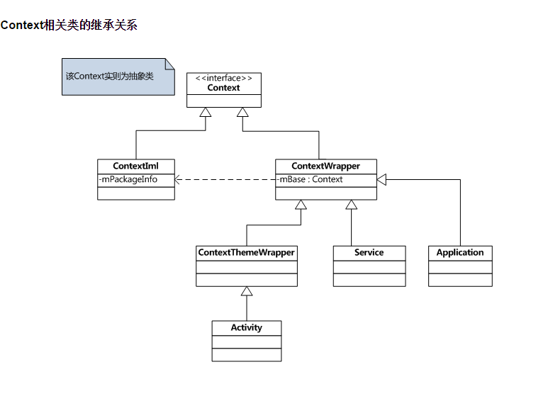
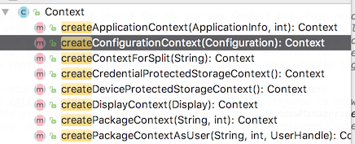

> `Context` 宏观来说是一个描述应用程序全局信息的场景，当然，本质上来说，这个“场景”其实是一个抽象类，它是一个应用程序的“灵魂人物”，从下面的图中就可以发现 `Activity`、`Service`、`Application` 都是 `Context` 的子类：



在开始之前，我们先来看一下这张图。

从图中我们可以发现，`Activity`、`Service`、`Application` 实际上都是 `Context` 的子类，它甚至可以说是整个 App 的灵魂。

但是你在之前的开发中是否有过这样的疑虑：`getContext()`、`this`、`getBaseContext()`、 `getApplicationContext()` 之间有什么不同？如果你的回答是 yes，那这篇文章或许可以帮你理清一些思路。

### Context 到底是什么？

一个 Android APK 安装包实际上就是一个 Android 组件的集合包。这些组件一般都被开发者声明在 Manifest 文件中，绝大部分由 Activity(UI)，Service(Background)， BroadcastReceiver (Action), ContentProvider (Data), 以及 Resources (images, strings 等) 组成。

开发者可以通过 IntentFilter 将某个组件暴露给系统，比如说发邮件或者分享图片；他们也可以选择只将某些组件暴露给自己应用中的其他组件。

同样地，Android 操作系统也是基于这个设计，这就使得它同样可以向外暴露自己的组件，较为常见的几个一般是 WifiManager，Vibrator 和 PackageManager。

Context 就是这些组件之间链接的桥梁。你可以使用 Context 在不同组件间进行通信、初始化组件或者是获得某个组件对象。

##### 1\. 开发者自定义组件之间的交互

这是比较常用的一个场景。我们使用 Context 实例化我们自己定义的组件，比如 Activity, Content Provider, BroadcastReceiver 等等。除此之外，我们还可以使用 Context 获取资源信息以及对文件系统进行操作等。

##### 2\. 自定义组件与系统组件的交互

Context 可以理解成是 Android 系统的入口。一些比较常用的系统级组件都是通过 Context 获取其对象的。比如说，你可以使用 `context.getSystemService(Context.WIFI_SERVICE)` 来获取 WifiManager 对象。

##### 3\. 自定义组件与其他 App 的组件的交互

实现这个的重点在于声明组件的时候，利用隐示意图，即 Intent-filter，将该组件尽可能地详尽化。下面是一个简单的发送邮件的隐示意图使用。

```
Intent emailIntent = new Intent(android.content.Intent.ACTION_SEND);
emailIntent.setFlags(Intent.FLAG_ACTIVITY_NEW_TASK);
emailIntent.setType("vnd.android.cursor.item/email");
emailIntent.putExtra(android.content.Intent.EXTRA_EMAIL, new String[]{address});
emailIntent.putExtra(android.content.Intent.EXTRA_SUBJECT, subject);
emailIntent.putExtra(android.content.Intent.EXTRA_TEXT, content); 
```

上面代码的效果就是，手机上所有能够发送邮件的 App 会合并为一个弹窗展示给用户，用户自己可以自由选择。

通过上面的介绍，我们基本可以达成一个共识，即**在 Android 世界中，所有的事物都可以理解成一个组件，而 Context 就是联系各个组件之间的纽带**。Context 可以帮助开发者在不同组件之间进行交互，可以获取系统级别的组件，还可以实例化某个组件。

### Context 的几种类型

你可以通过很多方式获得你想要的 Context 对象，**这是个极为糟糕的设计**。一般情况下，我们可以通过以下几种方式来获取 Context 对象。

*   在 Activity 中调用 Application 实例对象

*   在 Activity 中使用 this，即当前 Activity 的实例对象

*   在 Activity 中调用 getApplicationContext()

*   在 Activity 中调用 getBaseContext()

*   在 Fragment 或者 View 中调用 getContext()

*   Broadcast Receiver 或者 Service 回调中获得的 Context 对象

*   在 Service 中使用 this，即当前 Service 的实例对象

*   在 Service 中调用 getApplicationContext()

*   使用 Context 对象调用 getApplicationContext()

我把所有这些 Context 类型划分为两类：UI Context 和 Non-UI Context。

##### UI Context

实际上，只有 ContextThemeWrapper 是 UI Context，就是 Context + 你的 Theme 主题。

如果你去看看源码，你会发现 Activity 继承自 ContextThemeWrapper，这就是为什么你只是渲染了你的布局文件，但是展示出来的页面却有了你指定的主题。如果你使用一个 Non-UI Context 对布局文件进行渲染，你会发现你的布局没有主题。不信吗？自己去试试看。

在这种情况下，当你使用 Activity 实例作为 Context 使用时，就意味着你使用的是 UI Context；你在 Fragment 里调用 getContext() 方法，你也是在间接地使用 Activity。当然，前提是你的 Fragment 是在 Activity 中，通过 FragmentManager 添加到页面中的。

但是，_View.getContext() 却不能保证总是 UI Context_。

如果你的 View 是通过 LayoutInflator 渲染，并且 LayoutInflator 接收的 Context 也是 UI Context，那你得到的 View 的 Context 就是 UI Context；但是你渲染布局的 Context 不是 UI Context，那你得到的也是 Non-UI Context。

_UI Context_

*   在 Activity 中使用 this，即当前 Activity 的实例对象
*   在 Fragment 调用 getContext()
*   在_使用 UI Context 渲染_的 View 中调用 getContext()

##### Non-UI Context

所有不是 UI Context 的都是 Non-UI Context。换句话说，只有继承自 ContextThemeWrapper 的才是 UI Context。

Non-UI Context 基本上可以和 UI Context 完全划等号，可以做的事情完全一样，系统对 Non-UI Context 也没有任何限制。**再说一次，糟糕的设计。**但是像我们之前说的，如果你使用 Non-UI Context 去渲染布局，那你会丢失掉你的主题。

_Non-UI Context_

*   在 Activity 中调用 Application 实例对象
*   Broadcast Receiver 或者 Service 回调中获得的 Context 对象
*   在 Service 中使用 this，即当前 Service 的实例对象
*   在 Service 中调用 getApplicationContext()
*   在 Activity 中调用 getApplicationContext()
*   使用 Context 对象调用 getApplicationContext()

通过上面的分析，我们已经把所有的 Context 分为了两类。概况来说，UI Context 就是 Context + Theme，只要 ContextThemeWrapper 的子类都属于这个集合；其他的 Context 全部都是 Non-UI Context。

_需要注意的是，所有的 Context 都是在内存中短期存活的，只有 Application context 除外，也就是你通过 Application 实例充当的，或者通过调用 getApplicationContext() 方法拿到的 Context 对象。_

### 应用场景

##### 场景 1

假设你使用一个 Non-UI Context 渲染了一个布局文件，会发生什么呢？答案是什么都不会发生，除了你的布局没有主题之外。好像还不错是吧？这种程度的错误可以容忍。

##### 场景 2

你不小心使用了 UI Context 去获取资源文件，或者去读取了一个文件，会出现什么问题？还是什么都不会发生。记住这点，UI Context = Contex + Theme。在这种场景下，Non-UI Context 会和 UI Context 不会带给你什么不同。

##### 场景 3

和场景 2 差不多，你使用 UI Context 去下载一个文件。很明显，这是个耗时操作，会发生什么问题呢？恭喜你，内存泄漏。

假设你很幸运，下载速度很快，对象被正确回收，什么都没发生。太阳当空照，花儿对我笑。这也是大部分开发者常会犯的错误，他们把本应该短期存在的 UI Context 对象引用传递到某个会长期存活的任务重，但是最后也不会造成什么影响。

但是事情不总是这么幸运。有时候 Android 系统会检查你某个组件的内存占用情况或者为其他需要更多内存的应用分配内存，然后等待你的就是内存溢出导致的应用崩溃。

**再说一次，Context 的设计实在是太糟糕了。**

这就是错误使用 Context 对象可能导致的最严重的情况。遇到困难跌倒并不可耻，可耻的是每次都在同一个地方跌倒。如果你每次写代码都会内存泄漏，但是每次都是不同原因，那么恭喜你，你在成长。

使用 Context 的正确姿势：

1.  如果你需要处理 UI 相关的业务，比如渲染布局或者展示一个弹窗，使用 UI Context；否则，使用 Non-UI Context；
2.  涉及到耗时任务时，只使用 Application Context

### 不同 Context 之间的区别是什么

那么，this，getApplicationContext() 和 getBaseContext() 的区别是什么？

我们知道在手机运行的过程中，很多因素都一直在变化。比如说一些配置项就是始终变化，不能确定的。所有的这些变化都会使得 App 需要不停地重建，从而确保当前展示给用户的是正确的配置，横竖屏、切换语言、切换主题等等。你的 App 需要获取到最匹配的资源文件来展示给用户他们想要的效果，这就是 Context 的工作。

试着回答这个问题：

用户将本地语言设置为英文，但是你要给用户展示德文，你怎么实现？

下面是 Context 的一些 magic method：



image

我们可以看到 createConfigurationContext() 方法，来看看怎么使用：

```
public Context createConfigurationContext(Configuration overrideConfiguration){
    Configuration configuration = getResources().getConfiguration();
    configuration.setLocale(your_custom_locale);
    context = createConfigurationContext(configuration);
  return context;
} 
```

没错，通过这个方法，你可以获取任意自己想要的 Context 对象。当你使用这个新的 Context 对象时，你就能够拿到你配置的对应的资源信息。

现在我们回到之前的问题，**this，getApplicationContext() 和 getBaseContext() 的区别是什么？**

这是你在 Activity 中获取 Context 对象的几种方式。

1. this 指代的是当前 Activity 自身，UI Context，_在内存中短期存活_的 context；

2. baseContext 是最基本的 Context 对象，创建于 Application 创建时。之前我们介绍了 createConfigurationContext() 方法，你可以自定义自己的 Context 对象，然后通过 attachBaseContext() 方法，将原有的 Context 对象进行重置。

   一旦重置 baseContext，之后 Activity 的 Context 引用都会指向新的 Context；如果你不是在 Activity 中重置的，那你还可以通过 getBaseContext() 来获取 Activity 对象；

我们可以说，Context 就是 Android App 的灵魂，甚至说，你的 App 就是你的 Context。在 Android 开发中，没有 Context 你就什么都做不了；如果没有 Context，那你的 App 就只是一堆 Java 代码罢了。

### Android = Context + Java code

虽然我们吐槽了一次又一次 Context 的设计，但是系统设计如此，我们能做的也只是尽可能地去更好地使用它。

通过文章的第一部分，我们知道了我们主要使用 Context 来进行不同组件间的交互，获取系统级组件。

紧接着，我们知道了 Context 分为 UI Context 和 Non-UI Context，以及在内存中短期存活的和长期存活的 Context。

在之后，我们学习到要谨慎选择使用 Context，否则轻则有 UI 显示问题，重则有内存泄漏甚至内存溢出的问题。

最后，我们知道 Context 主要负责为 App 加载正确、合适的资源文件，也知道了怎么对 Context 进行自定义；还了解到了 this，applicationContext 和 baseContext 的区别。

很多人可能会建议你一直使用 Application Context，一劳永逸；

但我不这么想：不要因为害怕内存泄漏而始终使用 Application Context，你应该知道根本的原因，然后使用正确的 Context。