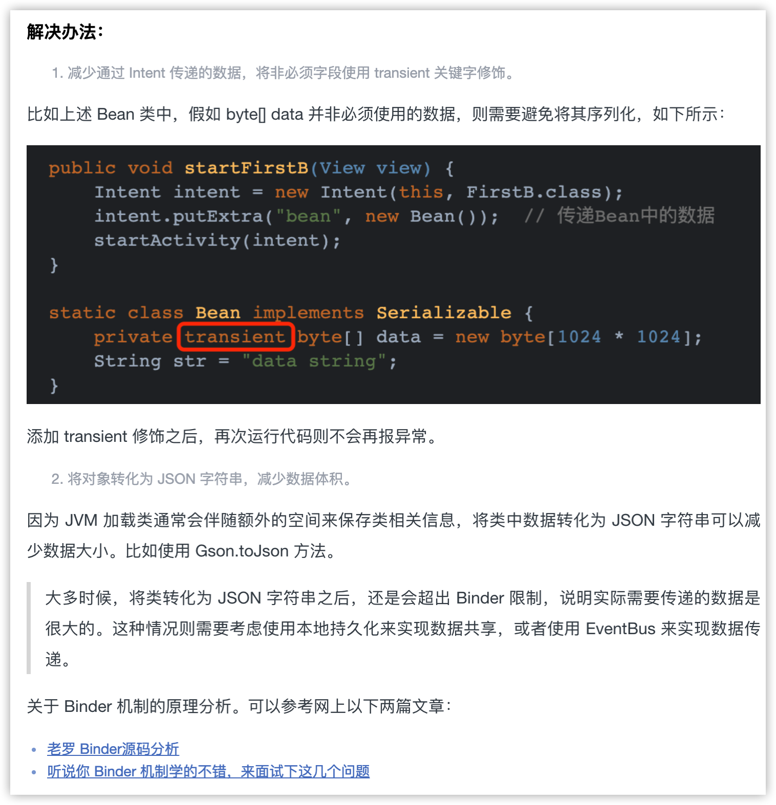

# Intent传输数据的大小有限制吗？如何解决？

#### 先说结论：

有大小限制

#### 再说原因：

Intent 是消息传递对象，用于各组件间通信。各组件以及个程序间通信都用到了进程间通信。因此 Intent 的数据传递是基于 Binder 的，Intent 中的数据会存储在 Bundle 中，然后 IPC 过程中会将各个数据以 Parcel 的形式存储在 Binder 的事物缓冲区（Binder transaction buffer）进程传递，而 Binder 的事物缓冲区有个固定的大小，大小在 1M 附近。因为这 1M 大小是当前进程共享的，Intent 中也会带有其他相关的必要信息，所以实际使用中比这个数字要小很多。

#### 解决方式：

1. 降低传递数据的大小，或考虑其他方式，见2；
2. IPC: 将大数据缓存到文件，或者存入数据库，或者图片使用 id 等；使用 Socket；
3. 非 IPC：可以考虑共享内存，EventBus 等

