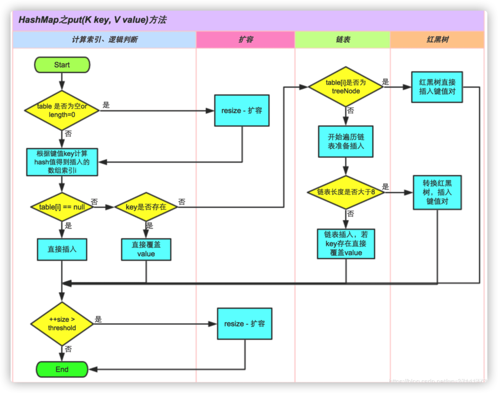
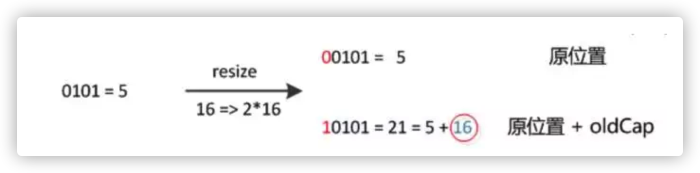
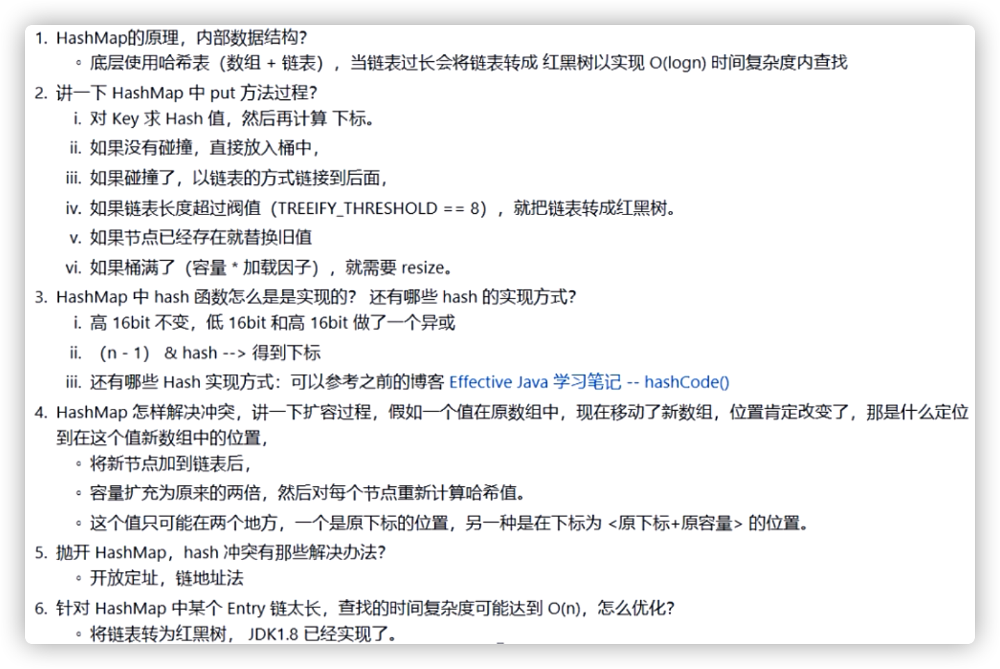

#### 1.7版本几个问题？

##### 1.数据结构

数组加链表

##### 2.怎么插入数据？

头插法

##### 3.哈希冲突怎么预防和解决？

二次哈希or扰动函数    拉链法

##### 4.HashMap默认容量是多少？

16 

##### 5.内部数组是什么时候创建的？

第一次put时

#### 1.8版本几个问题？

##### 1.数据结构

1.8添加了红黑树

##### 2.插⼊数据的⽅式？

1.7 的链表从前⾯插⼊，1.8 的链表从后⾯插⼊

##### 3.扩容后存储位置的计算⽅式？

1.7 通过再次 indexFor() 找到数组位置，1.8 通过⾼低位的桶直接在链表尾 部添加

##### 4.HashMap 什么时候会把链表转化为红⿊树？

链表⻓度超过 8 ，并且数组⻓度不⼩于 64

#### 面试题汇总

##### 1.HashMap的数据结构

A：哈希表结构（链表散列：数组+链表）实现，结合数组和链表的优点。当链表长度超过 8 时，并且数组长度不小于64，链表转换为红黑树。
transient Node<K,V>[] table;

##### 2.HashMap允许空键空值么

HashMap最多只允许一个键为Null(多条会覆盖)，但允许多个值为Null

##### 3.影响HashMap性能的重要参数

初始容量：`创建哈希表(数组)时桶的数量，默认为 16`
负载因子：哈希表在其容量自动增加之前可以达到多满的一种尺度，默认为 0.75

##### 4. HashMap的工作原理

HashMap是基于hashing的原理，我们使用put(key, value)存储对象到HashMap中，使用get(key)从HashMap中获取对象

##### 5. HashMap中put()的工作原理

##### 6.HashMap 的底层数组长度为何总是2的n次方

HashMap根据用户传入的初始化容量，利用无符号右移和按位或运算等方式计算出第一个大于该数的2的幂

- 使数据分布均匀，减少碰撞
- 当length为2的n次方时，h&(length - 1) 就相当于对length取模，而且在速度、效率上比直接取模要快得多

##### 7.1.8中做了哪些优化优化？

- 数组+链表改成了数组+链表或红黑树
- 链表的插入方式从头插法改成了尾插法
- 扩容的时候1.7需要对原数组中的元素进行重新hash定位在新数组的位置，1.8采用更简单的判断逻辑，位置不变或索引+旧容量大小
- 在插入时，1.7先判断是否需要扩容，再插入，1.8先进行插入，插入完成再判断是否需要扩容

##### **8.HashMap线程安全方面会出现什么问题**

- 在jdk1.7中，在多线程环境下，扩容时会造成环形链或数据丢失。
- 在jdk1.8中，在多线程环境下，会发生数据覆盖的情况

##### 9.为什么1.8改用红黑树 

比如某些人通过找到你的hash碰撞值，来让你的HashMap不断地产生碰撞，那么相同key位置的链表就会不断增长，当你需要对这个HashMap的相应位置进行查询的时候，就会去循环遍历这个超级大的链表，性能极其低下。java8使用红黑树来替代超过8个节点数的链表后，查询方式性能得到了很好的提升，从原来的是O(n)到O(logn)。

##### 10.1.8中的扩容为什么逻辑判断更简单

元素在重新计算hash之后，因为n变为2倍，那么n-1的mask范围在高位多1bit(红色)，因此新的index就会发生这样的变化：

因此，我们在扩充HashMap的时候，不需要像JDK1.7的实现那样重新计算hash，只需要看看原来的hash值新增的那个bit是1还是0就好了，是0的话索引没变，是1的话索引变成“原索引+oldCap” 

#### 面试原题

##### 阿里面试题

##### 常见面试题

- HashMap的底层数据结构？
- HashMap的存取原理？
- Java7和Java8的区别？
- 为啥会线程不安全？
- 有什么线程安全的类代替么?
- 默认初始化大小是多少？为啥是这么多？为啥大小都是2的幂？
- HashMap的扩容方式？负载因子是多少？为什是这么多？
- HashMap的主要参数都有哪些？
- HashMap是怎么处理hash碰撞的？
- hash的计算规则？