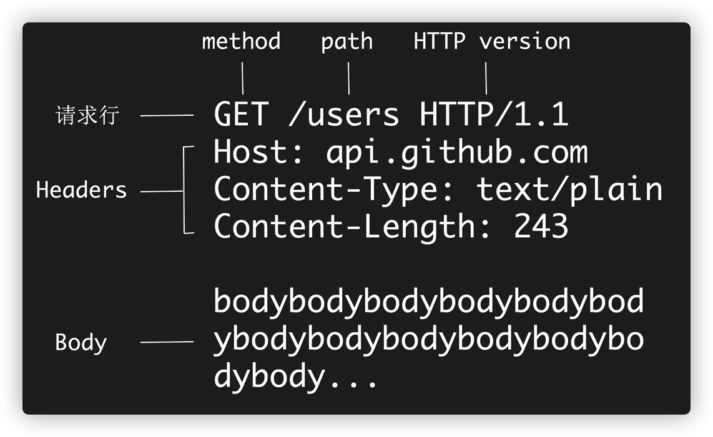
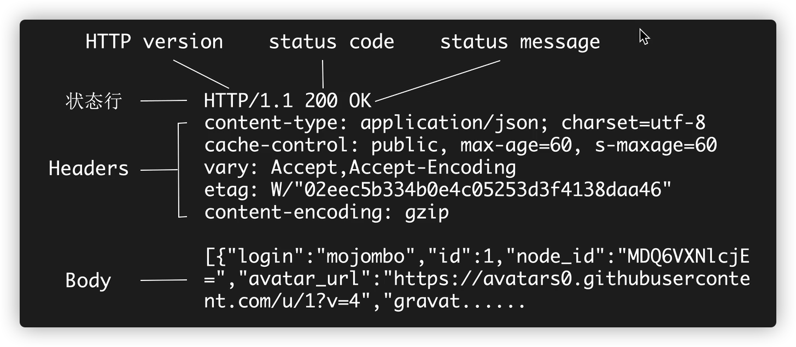

#### Http到底是什么

HyperText Transfer Protocol 超文本传输协议

- 超文本：在电脑中显示的、含有可以指向其他文本的链接的文本----HTML

#### 报文格式：Request

#### 报文格式：Response

#### 请求方法

- Get
  - 获取资源；没有Body
  - 幂等

- Post
  - 增加或修改资源；有Body
  - 不具有幂等性

- Put
  - 修改资源；有Body
  - 幂等

- DELETE
  - 删除资源；没有Body
  - 幂等
- HEAD

#### 状态码

- 1xx：临时性消息
- 2xx：成功
- 3xx：重定向
- 4xx：客户端错误
- 5xx：服务器错误

#### Header

作用：HTTP消息的元数据（metadata）

- Host：服务器主机地址
- Content-Type/ Content-length:Body的类型和长度
  - Content-length:内容的长度（字节）
  - Content-Type：内容的类型
    - text/html: html文本,用于浏览器页面响应
    - application/x-www-form-urlencoded:普通表单, encoded URL格式(纯文字表单)
    - multipart/form-data:多部分形式,一般用于传输包含二进制内容的多项内容
    - application/json:json形式,用于 Web Api的响应或POST/PUT请求
    - image/jpeg/  application/zlip..:单文件,用于 Web Api响应或POST/PUT请求
- Location:重定向的目标URL
- User-Agent:用户代理
- Cookie/Set-Cookie:发送 Cookie/设置 ookie
- Authorization:授权信息
- Accept:客户端能接受的数据类型。如text/ html
- Accept- Charset:客户端接受的字符集。如utf-8
- Accept- Encoding:客户端接受的压缩编码类型。如gzip
- Content- Encoding:压缩类型。如gzip

