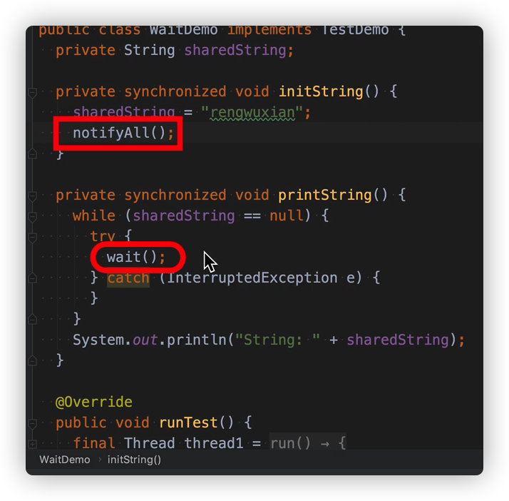
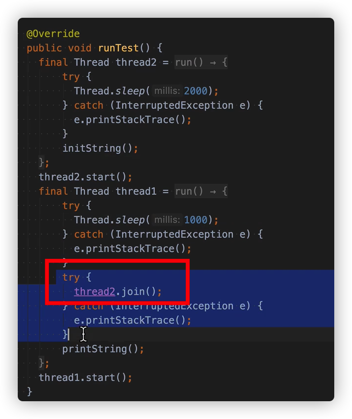

#### 结束线程

Thread.stop() 弃用

Thread.interrupt()

isInterrupted()       Thread.interrupted() 不仅会返回值，还是把中断值置为false

wait() notify()    notifyAll()

join()

yeild()

#### Sleep、yield、wait、join的区别

##### sleep与Wait的区别：

**sleep是线程方法，wait是object方法**

- sleep **，释放cpu资源，不释放锁资源，**如果线程进入sleep的话，释放cpu资源，如果外层包有Synchronize，那么此锁并没有释放掉。
- wait，**释放cpu资源，也释放锁资源，**一般用于锁机制中 肯定是要释放掉锁的，因为notify并不会立即调起此线程，因此cpu是不会为其分配时间片的，也就是说wait 线程进入等待池，cpu不分时间片给它，锁释放掉。

##### yield：

**让出CPU调度**，Thread类的方法，类似sleep，只是**不能由用户指定暂停多长时间 ，**并且yield()方法**只能让同优先级的线程**有执行的机会。 yield()只是使当前线程重新回到可执行状态，所以执行yield()的线程有可能在进入**到可执行状态后**马上又被执行。调用yield方法只是一个建议，告诉线程调度器我的工作已经做的差不多了，可以让别的相同优先级的线程使用CPU了，没有任何机制保证采纳。

##### join：

一种特殊的wait，当前运行线程调用另一个线程的join方法，当前线程进入阻塞状态直到另一个线程运行结束等待该线程终止。 注意该方法也需要捕捉异常。

##### 线程的状态

- 初始（NEW）
- 运行（RUNNABLE）reday+running
- 阻塞（BLOCKED）
- 等待（WAITING）
- 超时等待（TIMED_WAITING）
- 终止（TERMINATED）

