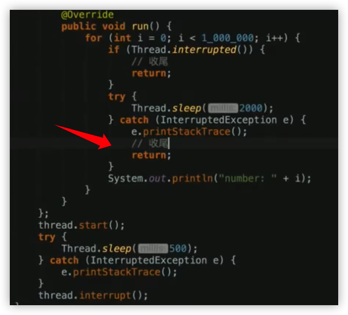
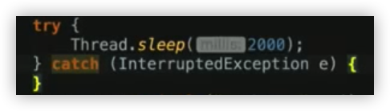
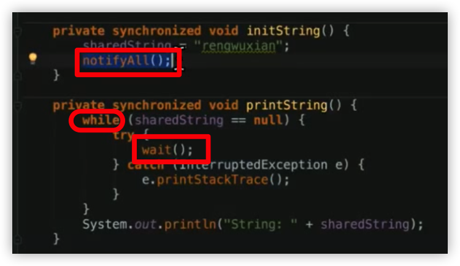

### 线程间交互

#### 一个线程终结另一个线程

- Thread.stop()
- Thread.interrupt()常用 温和式终结：不立即、不强制
  - isInterrupted()和Thread.interrupted()：检查和（重置）中断状态
  - InterruptedException：如果在线程「等待」时中断，或者在中断状态「等待」，直接结束等待过程（因为等待过程什么也不会做，⽽ interrupt() 的⽬的是让线程做完收 尾⼯作后尽快终结，所以要跳过等待过程）

注意：这里收尾是因为，中断结束睡眠，程序继续运行。因为抛异常也可以重置中断状态。所以程序里面如果有睡眠操作，就需要在中断异常里面进行中断处理。

​	如果只想睡2s，什么都不写就好了

或者用Android给的 ` SystemClock.sleep()`

#### Object.wait() 和 Object.notify() / notifyAll()

- 在未达到⽬标时 wait() 

- ⽤ while 循环检查 

- 设置完成后 notifyAll() 

- wait() 和 notify() / notifyAll() 都需要放在同步代码块synchronized⾥

#### Thread.join()：让另⼀个线程插在⾃⼰前⾯

#### Thread.yield()：暂时让出⾃⼰的时间⽚给同优先级的线程

