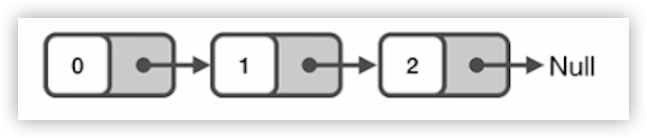
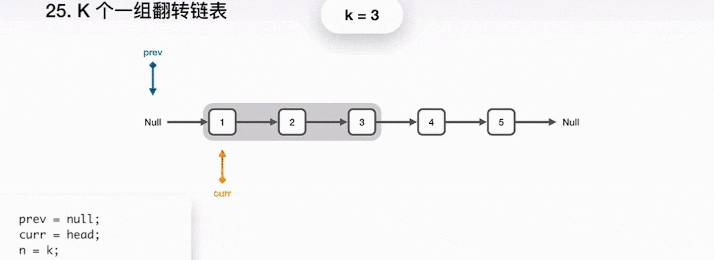

#### 数组、字符串（Array&String）

##### 数组的优缺点

优点：

- 构建非常简单
- 能在 O(1) 的时间里根据数组的下标（index）查询某个元素

缺点：

- 构建时必须分配一段连续的空间

- 查询某个元素是否存在时需要遍历整个数组，耗费 O(n) 的时间（其中，n 是元素的个数）

- 删除和添加某个元素时，同样需要耗费 O(n) 的时间

##### 例题：有效的字母异位词

给定两个字符串 s 和 t，编写一个函数来判断 t 是否是 s 的字母异位词。

说明：你可以假设字符串只包含小写字母。

示例 1																	示例 2

输入: s = "anagram", t = "nagaram" 				输入: s = "rat", t = "car"

输出: true															 输出: false

###### **解题思路：**

一个重要的前提“假设两个字符串只包含小写字母”，小写字母一共也就 26 个，因此：

1. 可以利用两个长度都为 26 的字符数组来统计每个字符串中小写字母出现的次数，然后再对比是否相等；

2. 可以只利用一个长度为 26 的字符数组，将出现在字符串 s 里的字符个数加 1，而出现在字符串 t 里的字符个数减 1，最后判断每个小写字母的个数是否都为 0。

按上述操作，可得出结论：s 和 t 互为字母异位词。

#### 链表（LinkedList）

单链表：链表中的每个元素实际上是一个单独的对象，而所有对象都通过每个元素中的引用字段链接在一起。

双链表：与单链表不同的是，双链表的每个结点中都含有两个引用字段。

##### 链表的优缺点

优点：

- 链表能灵活地分配内存空间；

- 能在 O(1) 时间内删除或者添加元素，前提是该元素的前一个元素已知，当然也取决于是单链表还是双链表，在双链表中，如果已知该元素的后一个元素，同样可以在 O(1) 时间内删除或者添加该元素。

缺点：

- 不像数组能通过下标迅速读取元素，每次都要从链表头开始一个一个读取；

- 查询第 k 个元素需要 O(k) 时间。

##### 链表应用场景

如果要解决的问题里面需要很多快速查询，链表可能并不适合；如果遇到的问题中，数据的元素个数不确定，而且需要经常进行数据的添加和删除，那么链表会比较合适。而如果数据元素大小确定，删除插入的操作并不多，那么数组可能更适合。

##### 解题技巧

1. 利用快慢指针（有时需要用到三个指针）

典型题目例如：链表的翻转，寻找倒数第 k 个元素，寻找链表中间位置的元素，判断链表是否有环等等。

2. 构建一个虚假的链表头

##### 例题：K个一组翻转链表

给你一个链表，每 k 个节点一组进行翻转，请你返回翻转后的链表。k 是一个正整数，它的值小于或等于链表的长度。如果节点总数不是 k 的整数倍，那么请将最后剩余的节点保持原有顺序。

说明：

你的算法只能使用常数的额外空间。

你不能只是单纯的改变节点内部的值，而是需要实际的进行节点交换。

示例：

给定这个链表：1->2->3->4->5

当 k=2 时，应当返回：2->1->4->3->5

当 k=3 时，应当返回：3->2->1->4->5

###### 解题思路：

- 将 curr 指向的下一节点保存到 next 指针；

- curr 指向 prev，一起前进一步；

- 重复之前步骤，直到 k 个元素翻转完毕；

- 当完成了局部的翻转后，prev 就是最终的新的链表头，curr 指向了下一个要被处理的局部，而原来的头指针 head 成为了链表的尾巴。