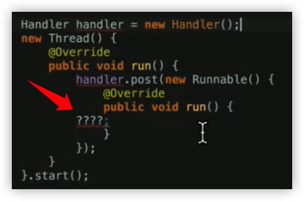

###  Handler

- 本质：在某个指定的运行中的线程上执行代码

  

- 思路：在接受任务的线程上执⾏循环判断

- 基本实现：

  - Thread ⾥ while 循环检查
  - 加上 Looper（优势在于⾃定义 Thread 的代码可以少写很多）
  - 再加上 Handler（优势在于功能分拆，⽽且可以有多个 Handler）

- Java 的 Handler 机制：

  - HandlerThread：具体的线程
  - Looper：负责循环、条件判断和任务执⾏ 
  - Handler：负责任务的定制和线程间传递

- AsyncTask：

  - AsyncTask 的内存泄露

    - 众所周知的原因：AsyncTask 持有外部 Activity 的引⽤
    - 没提到的原因：执⾏中的线程不会被系统回收
    - Java 回收策略：没有被 GC Root 直接或间接持有引⽤的对象，会被回收

      GC Root：

    1. 运⾏中的线程
    2. 静态对象
    3. 来⾃ native code 中的引⽤
       - 所以：
         - AsyncTask 的内存泄露，其他类型的线程⽅案（Thread、Executor、 HandlerThread）⼀样都有，所以不要忽略它们，或者认为 AsyncTask ⽐别的⽅ 案更危险。并没有。
         - 就算是使⽤ AsyncTask，只要任务的时间不⻓长（例如 10 秒之内），那就完全没 必要做防⽌内存泄露的处理。