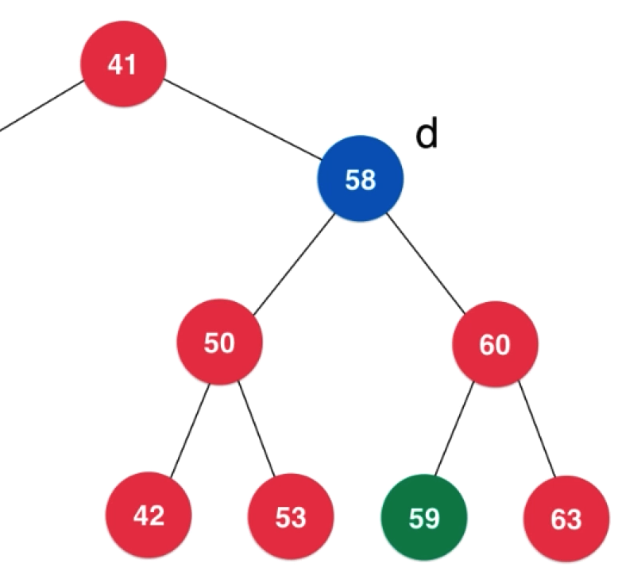
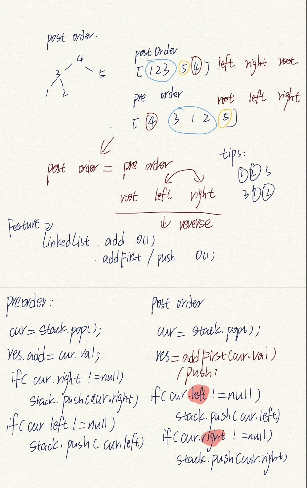

#### 深度优先遍历

##### 前序遍历

根 左 右

##### 中序遍历

左 根 右

遍历结果就是排序后的序列

##### 后序遍历

左 右 根

后序遍历的一个应用：为二分搜索树释放内存

#### 广度优先遍历

##### 层序遍历

队列实现

优点：更快得搜索

#### 删除任意节点

- 删除只有左孩子的节点
- 删除只有右孩子的节点
- 删除左右都有孩子的节点d
  - 找到s=min(d->right)
  - s是d的后继
  - s->right=removeMin(d->right)
  - s->left=d->left
  - 
  - 删除d，s是新的子树的根
  - 

