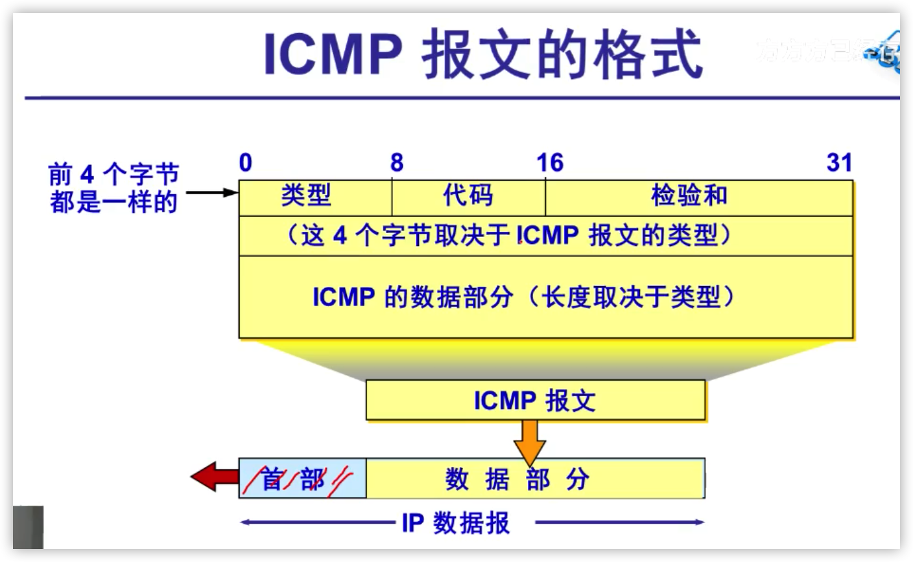
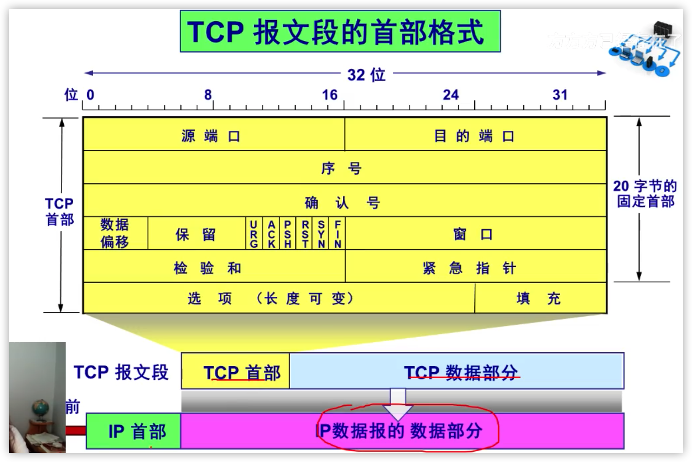

> 该笔记由Mut整理
>
> 2021年02月24日20:06:25

---

#### 1.2互联网概述

##### 1.2.1网络的网络

- 互联网（Internet）

- 计算机网络（简称为网络）

- 互连网（internetwork或internet）

> 在网络中，node的标准译名为“结点”
>
> 关于“云”，用云来表示网络。与网络相连的计算机常称为主机（host）

##### 1.2.2互联网基础结构发展的三个阶段

第一阶段：ARPANET

第二阶段：建成三级结构的互联网。分为主干网、地区网和校园网（或企业网）

第三阶段：多层次ISP结构的互联网。互联网服务提供者ISP（Internet service provider）

万维网WWW（world wide web）

##### 1.2.3互联网的标准化工作

- 互联网草案
- 建议标准        这个阶段形成RFC文档
- 互联网标准     形成一个标准后就分配到一个编号；一个标准可以和多个RFC文档关联

----

#### 1.3互联网的组成

##### 1.3.1互联网的边缘部分（资源子网）

由所有连接在互联网上的主机组成。这部分是用户直接使用的，用来进行通信和资源共享。

##### 端系统之间通信的含义：

“主机a与主机b进行通信”实际上是指：

“运行在主机a上的某个程序和运行在主机b上的另一个程序进行通信”

即“主机a的某个进程和主机b上的另一个进程进行通信”简称为“计算机之间通信”。

##### 端系统之间通信的两种方式：

客户-服务器方式（C/S方式）   Client/Server

对等方式（P2P方式）				Peer-to-Peer

- 1.客户服务器方式

  - 客户和服务器都是指通信中所涉及的两个应用进程。
  - 客户-服务器方式所描述的是进程之间服务和被服务的关系。
  - 客户是服务的请求方，服务器是服务的提供方。

  > 客户主动向服务器发起通信。因此，客户程序必须知道服务器程序的地址
  >
  > 服务器可以同时处理多个请求。一直不断地运行，被动地等待。因此，服务器程序不需要知道客户程序的地址。

- 2.对等连接

  - 是指两个主机在通信时并不区分哪一个是服务请求方还是服务提供方。
  - 只要两个主机都运行了对等连接软件（P2P软件）,它们就可以进行平等的\对等连接通信。

##### 1.3.2互联网的核心部分（通信子网）

由大量网络和连接这些网络的**路由器**组成。这部分是为边缘部分提供服务的。（提供连通性和交换）

> 处在互联网边缘的部分就是连接在互联网上的所有主机。这些主机又被称为端系统（end system）
>
> 端系统在功能上可能有很大的差别
>
> 小的：pc  智能手机
>
> 大的：大型计算机

路由器是实现**分组交换**的关键构件，其任务是**转发**收到的分组。

- 1.电路交换  两两连接

  - 电路交换必定是**面向连接**的
  - 三个阶段
    - 建立连接
    - 通信
    - 释放连接

  - 缺点：
    - 计算机数据具有突发性
    - 这导致在传送计算机数据时，通信线路的利用率很低

- 2.分组交换

  - 分组交换则采用**存储转发**技术
  - 在发送端，先把较长的报文**划分成较短的、固定长度的数据段**
    - 每一个数据段前面添加上**首部**构成**分组**（packet）
      - 每一个分组的首部都含有**地址**（目的地址和源地址）等控制信息
      - 分组交换网中的结点交换机根据收到的分组首部中的**地址信息**，把分组**转发**到下一个结点交换机
      - 每个分组在互联网中**独立地选择传输路径**
  - 最后还原成原来的报文

###### 路由器

- 在路由器中的输入和输出端口之间**没有直接连线**
- 路由器处理分组的过程是：
  - 把收到的分组先**放入缓存(暂时存储)**
  - **查找转发表**，找出到某个目的地址应从哪个端口转发
  - 把分组送到适当的端口**转发**出去

###### 主机和路由器的作用不同

- 主机是为**用户进行信息处理**的，并向网络发送分组，从网络接收分组
- 路由器对分组进行**存储转发**，最后把分组交付目的主机

###### **分组交换的优点**

| 优点 | 所采用的手段                                                 |
| ---- | ------------------------------------------------------------ |
| 高效 | 在分组传输的过程中**动态分配**传输宽带，对通信链路是逐段占用 |
| 灵活 | 为每一个分组独立地选择最合适的转发路由                       |
| 迅速 | 以分组作为传送单位，可以**不先建立连接**就能向其他主机发生分组 |
| 可靠 | 保证可靠性的网络协议；                                       |

###### **分组交换的缺点**

- 分组在各结点存储转发时需要**排队**，这就会造成一定的**时延**
- 分组必须携带的**首部**（里面有必不可少的控制信息）也造成了一定的**开销**

##### 1.5.1计算机网络的定义

##### 1.5.2几种不同类别的网络

- 1.从网络的作用范围进行分类
  - 广域网WAN（Wide Area Network）
  - 城域网MAN（Metropolitan Area Network）
  - 局域网LAN（Local Area Network）
  - 个人区域网PAN （Personal Area Network）
- 2.从网络的使用者进行分类
  - 公用网（public network）
  - 专用网（private network）
- 3.用来把用户接入到互联网的网络
  - 接入网（Access Network）本地接入网/居民接入网
  - 接入网本身既不属于互联网的核心部分，也不属于互联网的边缘部分
  - 从覆盖的范围看，很多接入网还是属于局域网
  - 从作用上看，接入网只是起到让用户能够与互联网连接的“桥梁”作用

#### 1.6计算机网络的性能

##### 1.6.1计算机网络的性能指标

- 速率 
  - 最重要性能指标，指的是**数据的传送速率**，也称为**数据率**（data rate）和**比特率**（bit rate）
  - **单位**是bit/s kbit/s Mbie/s Gbit/s
  - **速率往往是指额定速率或标称速率，非实际运行速率**
- 带宽
  - "带宽"本来指信号具有的**频带宽度**，单位是赫
  - 在计算机网络中，带宽用来表示网络中某通道传送数据的能力。表示在单位时间内网络中的某信道所能通过的“**最高数据率**”。单位是bit/s，即“比特每秒”
- 吞吐率
  - 吞吐量表示在单位时间内通过某个网络（或信道、接口）的数据量（漏斗）
  - 吞吐量更经常地用于对现实世界中的网络的一种测量，以便知道**实际上到底有多少数据量能够通过网络**
  - **吞吐量受网络带宽或网络的额定速率的限制**
- 时延
  - 时延（delay或latency）是指数据从网络（链路）一端传送到另一端所需的时间
  - 也称为延迟或迟延
  - 时延组成
    - 发送时延
    - 传播时延
    - 处理时延
    - 排队时延
- 时延带宽积
  - 时延带宽积=传播时延*带宽
- 往返时间RTT
  - 往返时间表示从发送方发送数据开始，到发送方收到来自接收方的确认，总共经历的时间
- 利用率
  - **信道利用率**和**网络利用率**
  - **信道利用率**是指某信道有百分之几的时间是被利用的
  - **网络利用率**则是全网络的信道利用率的加权平均值
  - 信道利用率并非越高越好。**当某信道的利用率增大时，该信道引起的时延也就迅速增加**

##### 1.6.2计算机网络的非性能指标

费用、质量、标准化、可靠性、可扩展性和可升级性、易于管理和维护

#### 1.7计算机网络的体系结构

##### 1.7.1计算机网络体系结构的形成

- 计算机网络是个非常复杂的系统
- 相互通信的两个计算机系统必须高度协调工作
- “分层”可将庞大而复杂的问题，转化为若干较小的局部问题
  - 开放系统互连基本参考模型OSI/RM **法律上的国际标准**
  - TCP/IP **事实上的国际标准**

##### 1.7.2协议与划分层次

- 计算机网络中的数据交换**必须遵守实现约定好的规则**

- **网络协议**，简称**协议**。是为进行网络中的数据交换而建立的规则、标准或约定

  - **语法**：数据与控制信息的结构或格式
  - **语义**：需要发出何种控制信息，完成何种动作以及做出何种响应
  - **同步**：事件实现顺序的详细说明

- 分层

  | 好处             | 缺点                                                 |
  | :--------------- | ---------------------------------------------------- |
  | 各层之间是独立的 | 降低效率                                             |
  | 灵活性好         | 有些功能会在不同的层次中重复出现，因而产生了额外开销 |
  | 结构上可分隔开   |                                                      |
  | 易于实现和维护   |                                                      |
  | 能促进标准化工作 |                                                      |

  各层完成的主要功能：

  - 差错控制
  - 流量控制
  - 分段和重装
  - 复用和分用
  - 连接建立和释放

##### 1.7.3具有五成协议的体系结构

- OSI 七层
- TCP/IP 4层：**应用层、传输层、网际层和网络接口层**
- **综合OSI和TCP/IP的优点，采用一种只有五层协议的体系结构**

##### 1.7.4实体、协议、服务和服务访问点

- **实体**：表示任何可发送或接收信息的硬件或软件进程
- **协议**是控制两个对等实体进行通信的规则的集合
- 在协议的控制下，两个对等实体间的通信使得本层能够向**上一层提供服务**
- 要实现本层协议，还需要**使用下层所提供的服务**
  - 协议的实现保证了能够向上一层提供服务
  - 本层的服务用户**只能看见服务**而无法看见下面的协议。即下面的协议对上面的服务用户是**透明的**
  - 协议是**水平**的：协议是控制对等实体之间通信的规则
  - 服务是**垂直**的：服务是由下层向上层通过层间接口提供的

##### 1.7.5TCP/IP的体系结构

### 第2章 物理层

#### 2.1物理层的基本概念

##### 物理层主要任务：

确定与传输媒体的接口的一些特性

- 机械特性：
- 电气特性
- 功能特性
- 过程特性

#### 2.2数据通信的基础知识

##### 2.2.1数据通信系统的模型

​		一个数据通信系统包括三大部分：源系统（发送端）、传输系统（传输网络）和目的系统（接收端、接收方）

##### 2.2.2有关信道的几个基本概念

- 信道
- 单向通信（单工通信）
- 双向交替通信（半双工通信）
- 双向同时通信（全双工通信）
- 基带信号（基本频带信号）。往往包含有较多的低频成分，甚至有直流成分。因此必须对基带信号进行**调制**
  - 基带调制：仅对基带信号的波形进行变换，使他能够与信道特性相对应。**变换后的信号仍然是基带信号**。**编码**
    - 数字信号常用的编码方式：不归零制、归零制、曼切斯特、差分曼切斯特
  - **带通调制**：使用**载波**进行调制，把基带信号的频率范围搬移到较高的频段，并转换为**模拟信号**。
    - 调幅、调频、调相
  - **带通信号**：经过载波调制后的信号

##### 2.2.3信道的极限容量

​	信噪比   香农公式

#### 2.3物理层下面的传输媒体

##### 2.3.1导引型传输媒体

##### 2.3.1非导引型传输媒体

#### 2.4信道复用技术

##### 2.4.1频分复用、时分复用和统计时分复用

##### 2.4.2波分复用

##### 2.4.3码分复用

#### 2.5数据传输系统

#### 2.6宽带接入技术

### 第3章 数据链路层

数据链路层使用的信道主要有以下两种类型：

- 点对点信道：一对一的点对点通信
- 广播信道：一对多的广播通信 

#### 3.1使用点对点信道的数据链路层

##### 3.1.1数据链路和帧

- 链路				物理链路

- 数据链路        逻辑链路

- 帧     **数据链路层传送的帧**

  

##### 3.1.2三个基本问题

- 封装成帧
  - 封装成帧就是在一段数据的前后分别添加首部和尾部，然后就构成一个帧。确定帧的界限。
  - 首部和尾部的一个重要作用就是进行**帧定界。**
  - 
  - **MTU**
  - 帧定界符  SOH帧开始符  EOT帧结束符
- 透明传输
  - 
  - 解决方法：**字节填充或字符填充**
    - 发送端的数据链路层在数据中出现控制字符的前面**插入一个转义字符ESC**
    - 接收端的数据链路层在将数据送往网络层之前**删除插入的转义字符**
    - 如果转义字符也出现在数据中，那么在转义字符前插入一个转义字符。
- 差错控制
  - 比特差错
  - 误码率BER(Bit Error Rate)
  - **循环冗余检验**
    - 在数据链路层传送的帧中，广泛使用了**循环冗余检验CRC**的检错技术
    - 在发送端，先把数据划分成祖。假定每组K个比特
    - 假定待传送的一组数据M=101001(现在K=6)。我们在M的后面再添加共差错检验用的n位**冗余码**一起发送
      - 冗余码的计算
        - 
    - 只要出错就丢弃
  - Tips:循环冗余检验CRC差错检测技术只能做到无差错接受(概率非常接近于1)
    - **要做到“可靠传输”（即发送什么就收到什么）就必须再加上确认和重传机制**  不重复 不丢失 不失序

#### 3.2点对点协议PPP

##### 3.2.1PPP协议的特点

对于点对点链路，目前使用最广泛的**数据链路层**协议是**点对点协议PPP**

**PPP协议应满足的需求**：

- 简单---**首要的要求**
- 封装成帧
- 透明性
- 多种网络层协议——能够在同一条物理链路上同时支持多种网络层协议
- 多种类型链路——能够在多种类型的链路上运行
- 差错检测
- 。。。

**PPP协议不需要的功能**：

- 纠错
- 流量控制
- 序号
- 多点线路
- 半双工或单工链路

##### 3.2.2PPP协议的组成

- 一个将IP数据报封装到串行链路的方法
- 链路控制协议LCP（Link Control Protocal）
- 网络控制协议NCP

##### 3.2.3 PPP协议的帧格式

##### 3.2.4PPP透明传输的方法

- 字符填充
- 比特填充

#### 3.3使用广播信道的数据链路层

##### 3.3.1局域网的数据链路层

##### 3.3.2适配器的作用

网络接口板又称为通信适配器（adapter）或网络接口卡NIC，或“网卡”

功能：

- 进行串行/并行转换
- 对数据进行**缓存**
- 在计算机的操作系统安装设备驱动程序
- 实现以太网协议
- 

##### 3.3.2CSMA/CD协议

P14 15 16

##### 3.3.5以太网的MAC层

###### 1.MAC层的硬件地址

- 在**局域网**中，**硬件地址**又称为物理地址，或**MAC地址**  都只网卡
- 48位
  - 
  - 前24厂家标识  
  - 后24厂家自行指派，保证生产出的适配器没有重复地址
- 
- 

#### 3.4扩展的以太网

##### 3.4.2在数据链路层扩展以太网

现在使用**以太网交换机**

**p18 将交换机**

#### 3.5高速以太网

p19

### 第4章 网络层

#### 4.1网络层提供的两种服务

网络提供数据报服务

- 网络层向上只提供简单灵活的、无连接的、尽最大努力交付的数据报服务
- 网络层不提供服务质量保证，不保证可靠传输

p21

#### 4.2网际协议IP

网际协议IP是TCP/IP体系中两个最主要的协议之一。

与IP协议配套使用的还有三个协议：

- 地址解析协议ARP
- 网际控制报文协议ICMP
- 网际组管理协议IGMP

##### 4.2.1虚拟互连网络

#####  4.2.2分类的IP地址

1.IP地址及其表示方法

2.常用的三种类别的IP地址

- 分类的IP地址
  - 网络号+主机号   
  - 主机号在它前面的网络号所指明的网络范围内必须是唯一的
  - 一个IP地址在整个互联网范围内是唯一的
  - 
  - 点分十进制记法
  - 
  - 主机号去掉全0 全1 2^8-2  全1表示所有
  - 
  - IP地址的一些重要特点
    - IP地址是一种分等级的地址结构，好处：
      - 方便IP地址的管理
      - 减小了路由表所占的存储空间
    - IP地址是标志一个主机（路由器）和一条链路的接口
    - 用转发器或网桥，交换机连接起来的若干个局域网仍为一个网络，因此这些局域网都具有同样的网络号
    - 所有分配到网络号的网络，都是平等的
    - 在同一局域网的主机或路由器的ip地址的网络号必须是一样的
- 子网的划分
- 构成超网

##### 4.2.3IP地址与硬件地址

- IP地址与硬件地址是不同的地址
- 从层次角度看
  - 硬件地址（物理地址）是数据链路层和物理层使用的地址
  - IP地址是网络层和以上各层使用的地址，是一种逻辑地址（因为IP地址是用软件实现的）。

##### 4.2.5地址解析协议ARP

- 从网络层使用的IP地址，解析出在数据链路层使用的硬件地址。
- 不管网络层使用的是什么协议，在实际网络的链路上传送数据帧时，最终还是必须使用硬件地址
- 每一个主机都设有一个ARP高速缓存，里面有所在局域网上各主机和路由器的IP地址到硬件地址的映射表
- 工作机制：
  - 主机A向本局域网上某个主机B发生IP数据报，先在其ARP高速缓存中查看有无主机B的IP地址
    - 有：查出对应硬件地址，再将此硬件地址写入MAC帧，然后通过局域网将该MAC帧发往此硬件地址
    - 没有：ARP进程在本局域网上**广播发送**一个**ARP请求分组**。收到**ARP响应分组**后，将得到的IP地址到硬件地址的映射写入ARP高速缓存。
- 作用：
  - 存放最近获得的IP地址到MAC地址的绑定，以减少ARP广播数量
  - 减少网络上的通信量
  - 主机B收到A的ARP请求分组时，将主机A的地址映射写入主机B自己的ARP高速缓存中。
- 注意问题：
  - ARP是解决**同一个局域网**上的主机或路由器的IP地址到硬件地址的映射问题。
  - 如果要找的主机和源主机**不在同一个局域网**，那么就要通过ARP找到一个位于本局域网上的某个路由器的硬件地址，然后把分组发送给这个路由器，由路由器转发给下个网络
  - ARP解析对用户透明
- 

##### 4.2.6IP数据报的格式

- 一个IP数据报由**首部**和**数据**两部分组成
- **首部的前一部分是固定长度，共20字节，是所有IP数据报必须具有的**
- 在首部的固定部分的后面是一些可选字段，其长度是可变的
- 
  - 
  - 最小20字节
  - 
  -  
  - 
  - 
  - 
  - 
  - 

##### 4.2.7IP层转发分组的流程

- 路由表中，对每一条路由（目的网络地址，**下一跳地址**）
- 查找路由表
- 特定主机路由
- 默认路由

#### 4.3划分子网和构造超网

##### 4.3.1划分子网

###### 1.从两级IP地址到三级IP地址

- IP地址：：={<网络号>,<子网号>,<主机号>}
- 划分为多个子网后对外仍是一个网络

###### 2.子网掩码

- 从一个IP数据报的首部并无法判断源主机或目的主机所连接的网络是否进行了子网划分
- 使用子网掩码可以找出IP地址中的子网部分
- 规则：
  - 子网掩码长度=32位
  - 某位=1：IP地址中对应对为网络号和子网号
  - 某位=0：IP地址中的对应位为主机号
- 
- （IP地址）AND（子网掩码）=子网的网络地址
- 
- 子网掩码是一个网络或一个子网的重要属性

##### 4.3.2使用子网时分组的转发

##### 4.3.3无分类编址CIDR（构造超网）

p29

#### 4.4网际控制报文协议ICMP

##### 4.4.1ICMP报文的种类

主要传递一些差错报文和其他需要注意的信息。

- 
- 种类：
  - ICMP差错报告报文
    - 终点不可达 
    - 时间超过
    - 参数问题
    - 改变路由（重定向）
    - 
    - 不发送的情况：
      - 对ICMP差错报告报文不再发送ICMP差错报告报文
      - 对第一个分片的数据报片的所有后续数据报片都不发送ICMP差错报告报文
      - 对具有多播地址的数据报都不发送ICMP差错报告报文
      - 对具有特殊地址的数据报不发送ICMP差错报告报文
  - ICMP询问报文
    - 回送请求和回答报文
    - 时间戳请求和回答报文
  - 
- ICMP报文的前4个字节是统一的格式，共有三个字段：即类型、代码和检验和。接着的4个字节的内容与ICMP的类型有关

##### 4.4.2ICMP的应用举例

- PING(packet Internet groper)
  - PING用来测试两个主机之间的连通性
  - PING使用了ICMP回送请求与回送回答报文
- Tranceroute的应用举例
  - 用来跟踪一个分组从源点到终点的路径

#### 4.5互联网的路由选择协议

P31

##### 4.5.1有关路由选择协议的几个基本概念

##### 4.5.2内部网关协议RIP

##### 4.5.3内部网关协议OSPF

##### 4.5.4外部网关协议BGP

##### 4.5.5路由器的构成

#### 4.6IPv6 

IPv4不够用 2^32

##### 4.6.1ipv6的基本首部

- 主要变化：
  - 更大的地址空间：128位
  - 扩展的地址层次结构
  - 灵活的首部格式
  - 改进的选项
- IPv6数据报由两大部分组成：
  - 基本首部
  - 有效载荷。有效载荷允许有零个或多个扩展首部，再后面是数据部分
- 
- 
- 

##### 4.6.2IPv6的地址

##### 4.6.3从IPv4向IPv6过渡

##### 4.6.4ICMPv6

P32

#### 4.7IP多播

#### 4.8 虚拟机专用网VPN和网络地址转换NAT

##### 4.8.1虚拟专用网VPN

#### 4.9多协议标记交换MPLS

### 第5章运输层（传输层）

#### 5.1运输层协议概述

##### 5.1.1进程之间的通信

- 根据应用程序的不同需求，运输层需要有两种不同的运输协议，即**面向连接TCP**和**无连接的UDP**。
- 基于端口的复用和分用功能
  - 
- 面向连接的TCP协议时，尽管下面的网络是不可靠的（只提供尽最大努力服务），但这种逻辑通信信道就相当于一条全双工的可靠信道
- 无连接的UDP协议时，这种逻辑通信信道是一条不可靠信道

##### 5.1.2 运输层的两个主要协议

TCP/IP的运输层有两个主要协议：

- 用户数据报协议（UDP）一种无连接协议
  - 提供无连接服务
  - 在传送数据之前不需要先建立连接
  - 传送的数据单位协议是**UDP报文或用户数据报**
  - 对方的运输层在收到UDP报文后，不需要给出任何确认
  - UDP不提供可靠交付，但在某些情况下UDP是一种最有效的工作方式
- 传输控制协议（TCP）一种面向连接的协议
  - 提供面向连接的协议
  - TCP报文段
  - TCP不提供广播或多播服务
  - 由于TCP要提供可靠的、面向连接的运输服务，因此不可避免地增加了许多的开销。

##### 5.1.3运输层的端口

- 端口号只具有**本地意义**，即端口号只是为了标志**本计算机应用层中的各进程**
- 端口用一个16位端口号进行标志
- 类型：
  - 服务器端使用的端口号
    - 熟知端口，数值一般为0~1023
    - 登记端口号，1024~49151
  - 客户端使用的端口号
    - 短暂端口号，49152~65535

#### 5.2用户数据报协议UDP

##### 5.2.1UDP概述

- UDP只在IP的数据报服务之上增加了很少一点功能：
  - 复用和分用的功能
  - 差错检测的功能
- 主要特点：
  - UDP是无连接的
  - UDP使用尽最大努力交付
  - UDP是面向报文的。UDP对应用层交下来的报文，既不合并，也不拆分，一次交付一个完整的报文。所以应用程序必须选择合适大小的报文。
  - UDP没有拥塞控制
  - UDP支持一对一、一对多、多对一和多对多的交互通信
  - UDP的首部开销小，只有8个字节，比TCP的20个字节的首部要短

##### 5.2.2UDP的首部格式

- 在计算校验和的时候加入伪首部，拿着伪首部和首部一起计算检验和

#### 5.3传输控制协议TCP概述

##### 5.3.1TCP的主要特点

- TCP是**面向连接**的运输层协议
- 每一条TCP连接**只能有两个端点**，每一条TCP连接**只能是点对点的**（一对一）
- TCP提供**可靠交付**的服务
- TCP提供**全双工**通信
- **面向字节流**
  - TCP的“流”指的是流入或流出进程的字节序列
  - “面向字节流”的含义是：虽然应用程序和TCP的交互是一次一个数据块。但TCP吧应用程序交下来的数据看成仅仅是一连串无结构的字节流
  - 
- 注意：
  - TCP连接是一条虚连接
  - TCP根据对方给出的窗口值和当前网络拥塞的程度来决定一个报文段应包含多少个字节
  - TCP可把太长的数据块划分短一些再发送
  - TCP也可等待积累有足够多的字节后再构成报文段再发送

##### 5.3.2TCP的连接

- TCP把连接作为**最基本的抽象**
- 每一条TCP连接有两个端点
- TCP连接的端点不是主机，不是主机IP地址，不是应用进程，也不是运输层的协议端口
  - **TCP连接的端口叫做套接字（socket）或插口**
- **端口号拼接到IP地址即构成了套接字**
  - 

#### 5.4可靠传输的工作原理

###### 理想的传输条件特点：

- 传输信道不产生差错
- 不管发送方以多快的速度发送数据，接收方总是来得及处理收到的数据
- 但实际的网络都不具备以上两个理想条件

##### 5.4.1停止等待协议

发送-等待-收到确认-发送

- 无差错情况
  - 
- 出现差错
  - 解决方法：超时重传
- 确认丢失和确认迟到
  - 

##### 5.4.2连续ARQ协议

- 
- 

#### 5.5TCP报文段的首部格式

TCP报文段首部的前20个字节是固定的，后面有4n字节是根据需要而增加的选项。

**因此TCP首部的最小长度是20字节。**

- 源端口和目的端口——各占2个字节
- 序号——占4个字节。TCP连接中传送的数据流中的每一个字节都编上一个序号。序号字段的值则指的是本报文段所发送的数据报文中的第一个字节的序号。
- 确认号——占4字节。是期望收到对方的下一个报文段的数据的第一个字节的序号。
  - 在同一个TCP报文中，序号和确认号是没有关系的
- 数据偏移（首部长度）——占4位，
- URG紧急指针——=1，则紧急指针字段有效。
- 确认ACK——只有当ACK=1是确认号字段才有效
- 推送PSH——接收TCP收到PSH=1的报文段，就尽快地交付接收应用进程，而不再等到整个缓存都填满后再向上交付。
- 复位RST——=1时，必须重新建立运输连接
- 同步SYN——同步SYN=1表示这是一个连接请求或连接接收报文
- 终止FIN——用来释放一个连接。
- 窗口字段——2字节，用来让对方设置发送窗口的依据，是我的接收窗口大小
- 检验和——2字节。要加伪首部

#### 5.6TCP可靠传输的实现

##### 5.6.1以字节为单位的滑动窗口

##### 5.6.2超时重传时间的选择

P36

##### 5.6.3选择确认SACK

#### 5.7TCP的流量控制

##### 5.7.1利用滑动窗口实现流量控制

- 可能出现互相等待死锁
- TCP为每一个连接设有一个持续计时器，计时器时间到期，发送一个零窗口探测报文段。

##### 5.7.2TCP的传输效率

##### 5.8.1拥塞控制的一般原理

##### 5.8.2TCP的拥塞控制方法

- 拥塞的判断
  - 重传定时器超时
  - 收到三个相同的ACK

- 慢开始
  - 慢开始不是指 cwnd 的增长速度慢（指数增长），而是指 TCP 开始发送设置 cwnd=1。
  2. 思路：不要一开始就发送大量的数据，先探测一下网络的拥塞程度，也就是说由小到大 逐渐增加拥塞窗口的大小。这里用报文段的个数的拥塞窗口大小举例说明慢开始算法，实时 拥塞窗口大小是以字节为单位的。

  3. 为了防止 cwnd 增长过大引起网络拥塞，设置一个慢开始门限（ssthresh 状态变量） 当 cnwd＜ssthresh，使用慢开始算法 当 cnwd=ssthresh，既可使用慢开始算法，也可以使用拥塞避免算法 当 cnwd＞ssthresh，使用拥塞避免算法
- 拥塞避免
- 快重传
- 快恢复
- 慢开始+拥塞避免
  - 
  - 超时发送时：门限值 变成拥塞窗口减半，拥塞窗口置为1，进入慢开始
  - 多次确认：门限减半变成拥塞窗口减半，拥塞窗口=门限值，并直接开始拥塞避免

#### 5.9TCP的运输连接管理

- TCP连接的建立采用**客户服务器方式**

##### 5.9.1TCP的连接建立

- TCP建立连接的过程叫做**握手**
- **三次握手**
-  三次握手主要是为了防止已失效的连接请求报文段突然又传送到了，因而产生错误
-  

##### 5.9.2TCP的连接释放

- TCP连接释放过程是**四次挥手**
- 
- A必须等待2MSL的时间
  - 第一，为了保证A发送的最后一个ACK报文段能够到达B
  - 第二，防止“已失效的连接请求报文段”出现在本连接中

##### 5.9.3TCP的有限状态机

#### 总结

##### TCP可靠传输

- 建立连接：三次握手
- 发送数据：窗口（序号，发送窗口+接收窗口），确认机制，流量控制，拥塞控制（发现什么时候拥塞，让拥塞来得越晚越好），超时重传。。。。
- 连接释放：四次握手

### 第6章 应用层

#### 6.1域名系统DNS

##### 6.6.1域名系统概述

- 域名服务器

#### 6.2文件传送协议

#### 6.3远程终端协议TELNET

#### 6.4万维网WWW

- 统一资源定位符URL
- 超文本传送协议HTTP
  - 面向事务的应用层协议
  - 
- 超文本标记语言HTML
- 搜索工具（搜索引擎）
- **用户点击URL后所发生的事情**
  - 浏览器分析超链接指向页面的URL
  - 浏览器向DNS请求解析www.xxxx.com的IP地址
  - 域名系统DNS解析出清华大学服务器的IP地址
  - 浏览器与服务器建立TCP连接
  - 浏览器发出取文件命令：GET
  - 服务器给出响应，把文件index.html发给浏览器
  - TCP连接释放
  - 浏览器显示文件中的所有文本

##### 6.4.1HTTP

- HTTP的报文结构（请求报文）
  - 

- HTTP响应报文
  - 
- 状态码：
  - 1xx表示通知信息的
  - 2xx表示成功
  - 3xx表示重定向
  - 4xx表示客户的差错
  - 5xx表示服务器的差错
- 在服务器上存放用户的信息  
  - Cookie表示在HTTP服务器和客户之间传递的状态信息
  - 使用cookie的网站服务器为用户产生一个唯一的识别码。利用此识别码，网站就能够跟踪该用户在该网站的活动

#### 6.5电子邮件

#### 6.6动态主机配置协议DHCP

#### 6.7简单网络管理协议SNMP

#### 6.8应用进程跨越网络的通信

#### 6.9P2P应用

